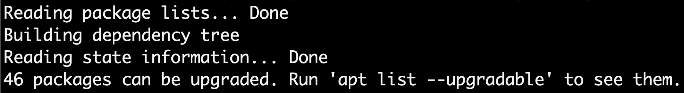
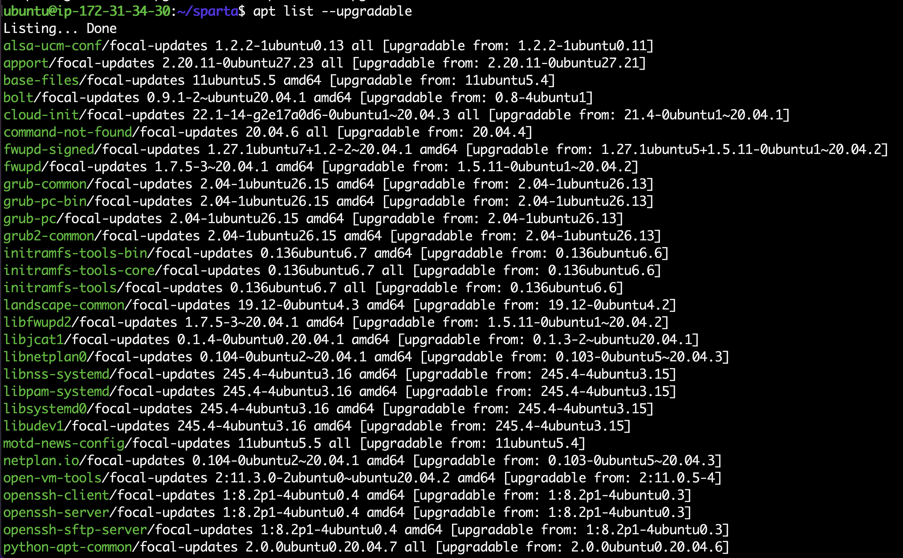

# [ubuntu] 우분투 업데이트 오류 : /var/lib/dpkg/lock-frontend 에러 해결

```Bash
E: Could not get lock /var/lib/dpkg/lock-frontend. It is held by process 2813 (apt-get)
N: Be aware that removing the lock file is not a solution and may break your system.
E: Unable to acquire the dpkg frontend lock (/var/lib/dpkg/lock-frontend), is another process using it?

혹은

Waiting for cache lock: Could not get lock /var/lib/dpkg/lock-frontend 오류를 해결해보겠습니다.
```

먼저, 실행중인 apt 관련 프로세스를 모두 kill하는 명령입니다.
```Bash
sudo killall apt apt-get
```
apt: no process found 를 반환하면 아래 코드들을 순서대로 적용합니다.
```Bash
sudo rm /var/lib/apt/lists/lock
```

만약, rm: cannot remove ‘/var/lib/apt/lists/lock’: No such file or directory 등의 오류를 반환한다고 해도 
무시하고 차례대로 코드를 입력합니다.
```Bash
sudo rm /var/cache/apt/archives/lock
```
```Bash
sudo rm /var/lib/dpkg/lock*
```
rm 명령을 사용하여 오류가 나는 부분을 모두 삭제하였습니다.

다시 패키지 업데이트를 진행하겠습니다.
```Bash
sudo dpkg --configure -a
```
삭제 완료 후 업데이트를 다시 진행합니다.
```Bash
sudo apt update
```
결과)👇

저는 업데이트를 성공했는데 다시 패키지 업데이터를 할수 있다고 나옵니다.


그래서 위와 같이 패키지를 모두 업그레이드함.

